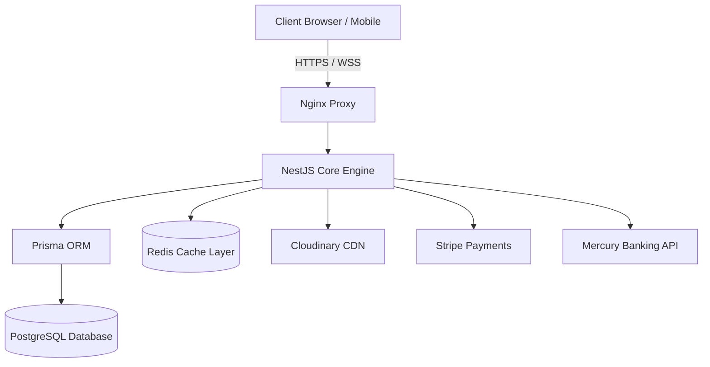

# 🏛️ Architecture Simple — Backend System Manual

A high-performance, strictly typed, and security-hardened NestJS microservice architecture powering a premier design and project management ecosystem.

---

## ⚡ Architecture Overview



This backend is built on **NestJS** with **Prisma ORM** connecting to a **PostgreSQL** database, backed by a global **Redis** caching mechanism. The codebase utilizes modern TypeScript strict standards (`noImplicitAny: true`), automated input validation, role-based access control, and industry-standard security practices.

---

## 📂 Core Module Catalog

The backend is structured into domain-specific, decoupled modules under `src/modules/`. Here is the architecture of each system:

### 1. `auth` (Authentication & Security)
The security core of the application.
* **Purpose**: Manages secure user session lifecycles, OAuth registrations, and cryptographic validations.
* **Strategies**:
  * **JWT Access Strategy**: Decodes and validates short-lived JSON Web Tokens for API requests.
  * **JWT Refresh Strategy**: Uses cryptographically secure refresh tokens to renew active sessions.
  * **Google OAuth Strategy**: Handles third-party registration/login flows.
* **Guards**: `JwtAuthGuard` (session validation) and `RolesGuard` (strict role-based access permission).

### 2. `users` (Identity & Member Profiles)
Manages user accounts, active directories, and profile settings.
* **Purpose**: Handles profile onboarding, employee directories, and permission adjustments.
* **Roles System**:
  * `SUPER_ADMIN`, `ADMIN` (Full administrative access)
  * `HIGHER_MANAGER`, `PROJECT_MANAGER` (Project planning, proposal management, team delegation)
  * `DRAFTER`, `EMPLOYEE` (Task completion and stage updates)
  * `CLIENT` (Dashboard access, billing, and proposals)

### 3. `project-manager` (Enterprise Management Engine)
The central core of the company's design operations. Divided into four sub-services:
* **`project-request`**: Handles customer design inquiries and converts lead forms into project opportunities.
* **`proposal`**: Manages the drafting, service breakdown, pricing, and client e-signing of project contracts. When accepted, it automatically bootstraps a new project workspace.
* **`project-stage`**: Manages milestones, stage status updates, task tracking, and milestone percentages.
* **`team`**: Handles delegating architects, designers, and drafters to specific active projects.

### 4. `refund` (Sensitive Financial Claims)
Manages financial refund workflows and bank credentials.
* **Purpose**: Allows clients to submit refund claims and manage routing/account details securely.
* **Security & Cryptography**: Uses a global **AES-256-GCM authenticated encryption** system. Bank account and routing numbers are automatically encrypted at rest in the database and decrypted seamlessly on-the-fly upon authorized admin retrieval.

### 5. `financial` (Budget Planning & Metrics)
The business intelligence engine of the system.
* **Purpose**: Calculates complex project finances, actual vs. target labor hours, overhead expenses, and project margins.
* **Integrations**: Integrates directly with the **Mercury Banking API** for real-time financial tracking and disbursement data.

### 6. `payment` (Stripe Billing Engine)
Seamless payment processing gateway.
* **Purpose**: Generates Stripe checkout sessions, handles invoices, and manages multi-stage client payments.
* **Stripe Webhook Handler**: Securely validates and parses incoming Stripe payment event webhooks to automatically mark invoices as paid and transition project phases.

### 7. `media` (Cloudinary Asset Delivery)
Manages static media assets and interactive web features.
* **Purpose**: Handles file upload pipelines, compresses assets, and hosts home page hero templates.
* **CDN Strategy**: Powered by a custom **Cloudinary upload strategy** with optimized image/video processing pipelines.

### 8. `notification` (Real-Time Communication)
Global system notifications.
* **Purpose**: Triggers real-time dashboard notifications and automated transactional HTML emails (via Nodemailer) for actions like refund status shifts, proposal signatures, and milestone approvals.

---

## 🔒 Crucial Security Policies

### 1. Environment Variable Protection
* **NEVER** commit `.env` files to git. `.gitignore` is pre-configured to ignore all local environment configurations.
* **Secret Rotation**: All high-risk credentials (Stripe, Mercury, Neon DB, SMTP, JWT Secrets) have been rotated. Keep keys locked down in the server's vault.

### 2. Encryption at Rest
All bank credentials are encrypted using standard AES-256-GCM. 
* Encryption key must be a **32-byte (64-character) hex string**.
* If `ENCRYPTION_KEY` is not present, the system falls back to a development key and prints a security warning to the console. **Make sure this is set in production.**

---

## 🛠️ Development & Deployment Quickstart

### Local Setup
1. **Clone & Install**:
   ```bash
   npm install
   ```
2. **Setup Database**:
   Configure `DATABASE_URL` in `.env` and push the schema:
   ```bash
   npx prisma db push
   ```
3. **Run Dev Server**:
   ```bash
   npm run start:dev
   ```

### Code Quality Commands
* **Run Linter**: `npm run lint`
* **Strict Type Check**: `npx tsc --noEmit`
* **Build Production Bundle**: `npm run build`

### Production Docker Deployment (VPS)
Rebuild and run the system using Docker Compose:
```bash
# Force compile and rebuild
docker compose down
docker compose up --build -d
```
